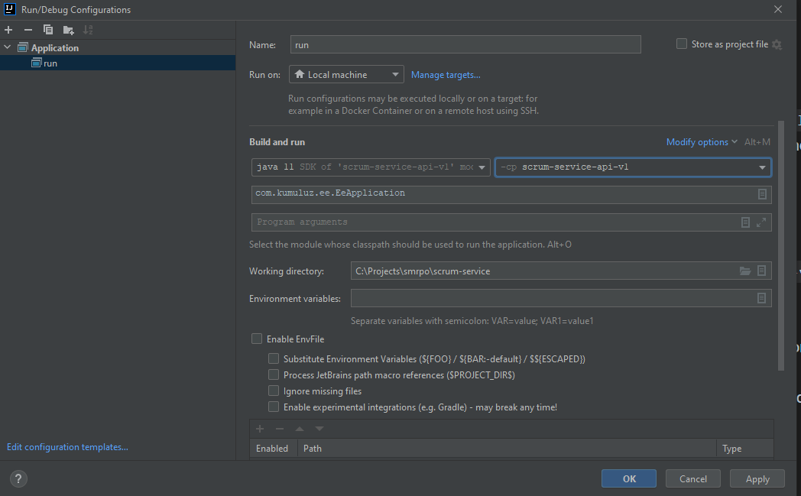
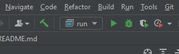

# scrum-service
[](https://github.com/smrpo-22-7/scrum-service/actions/workflows/ci.yml)

## Requirements

* Java 11 (JDK + JRE) [Download](https://jdk.java.net/java-se-ri/11)
* Maven v3.6+ [Download](https://maven.apache.org/download.cgi)
* Running instance of postgres database


## Development

To build project you need to run in root of a project `mvn clean package` to build all the 
modules.

To build docker image, run previous maven command first and then `docker build -t scrum-service .` in root of a project. 

### Run locally

#### via CLI

1. Build project: `mvn clean package`
2. Move to `api` module: `cd ./v1/api/`
3. Run `api` module: `java -cp target/classes:target/dependency/* com.kumuluz.ee.EeApplication` (Linux) 
   or `java -cp "target/classes;target/dependency/*" com.kumuluz.ee.EeApplication` (Windows)

#### via IntelliJ IDEA

1. Click on `Add Configuration...` button.
2. Click on `plus` button and then select `Application`
3. Enter name, then where it says `-cp <no module>` select `scrum-service-api-v1` module.
4. For main class enter `com.kumuluz.ee.EeApplication`
5. Working directory stays at project root
6. (optional) If needed, you can also configure environment variables by clicking on icon next to `Environment variables` line.



7. Save.
8. Where you previously had `Add Configuration...` you should now see your configuration and click green play button.



## Project structure

* `persistence`: module containing DB related code - schemas, migrations, entities
* `services`: module containing services (Java CDI beans) with application logic.
* `v1`:
  * `api`: module containing API definitions (endpoints), filters, mappers, etc.
  * `lib`: module containing data types that are exposed via APIs (public information).

### Configuration

Config file is in `api` module on path `v1/api/src/main/resources/config.yml`. All values can be 
overriden using environment values ie. key `kumuluzee.server.base-url` can be 
overriden by setting `KUMULUZEE_SERVER_BASEURL` environment variable.

## Database

To quickly setup database, you can use docker-compose in the root of a project with the following command:

```
docker-compose up -d scrum-postgres
```

This command runs only specified service from docker compose file.
